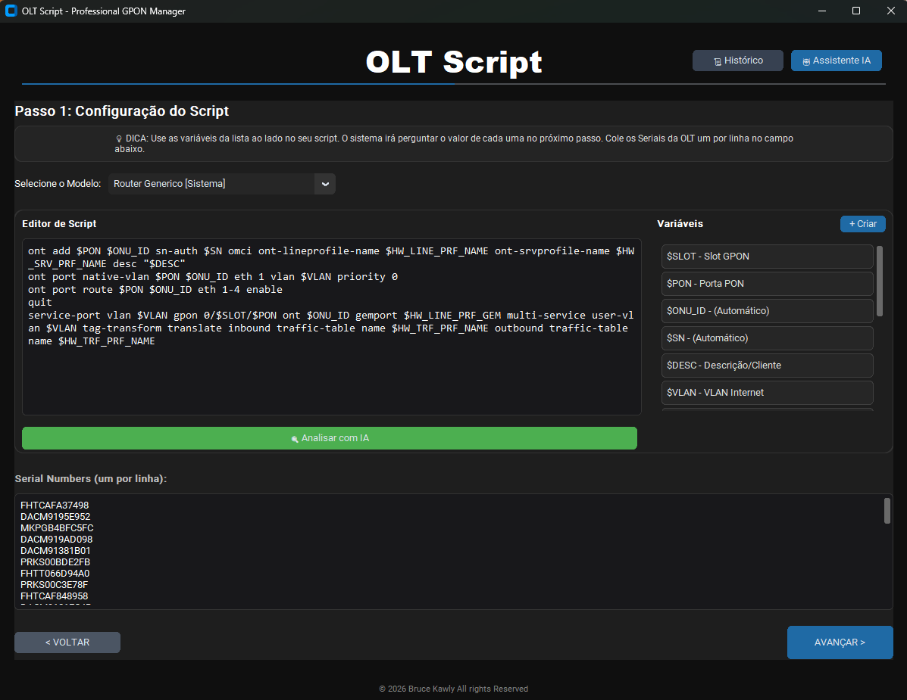

# OLT Script - v1.0 🚀
O **OLT Script** é uma ferramenta profissional desenvolvida para simplificar e automatizar o provisionamento de ONUs em OLTs de diversos fabricantes. Com uma interface moderna e integração com IA, ele transforma a tarefa de gerar scripts complexos em um processo rápido e seguro.




## ✨ Funcionalidades (v1.0)

- **Suporte Multi-Fabricante**: Preparado para Huawei, ZTE, Fiberhome, Datacom e mais.
- **Modelos Inteligentes**: Templates pré-configurados para Router, Bridge e VEIP (Huawei).
- **Editor de Scripts**: Personalize scripts em tempo real com suporte a variáveis dinâmicas.
- **Validação com IA**: Integração com Gemini API para analisar scripts e sugerir melhorias técnicas.
- **Gestão de Seriais**: Suporte a múltiplos Seriais de uma só vez com validação automática.
- **Histórico de Scripts**: Log completo de todos os scripts gerados para consulta rápida.
- **Portabilidade Total**: Funciona em qualquer pasta ou PC, mantendo os dados locais.

## 🛠️ Tecnologias Utilizadas

- **Python 3.10+**
- **CustomTkinter**: Interface gráfica moderna e responsiva.
- **SQLite3**: Banco de dados local para templates e logs.
- **Google Gemini API**: Inteligência Artificial para análise técnica.

## 🚀 Como Iniciar

1. Clone o repositório:
   ```bash
   git clone https://github.com/seu-usuario/migrador-olt.git
   ```
2. Instale as dependências:
   ```bash
   pip install -r requirements.txt
   ```
3. Execute a aplicação:
   ```bash
   python main.py
   ```

## 📝 Próximas Versões

- [ ] Implementação de templates padrão para ZTE (C3xx e C6xx).
- [ ] Implementação de templates para Fiberhome (AN6000 e AN5506).
- [ ] Exportação direta para Excel/PDF.

## 👤 Autor

Desenvolvido por **Bruce Kawly**
© 2026 Todos os direitos reservados.

